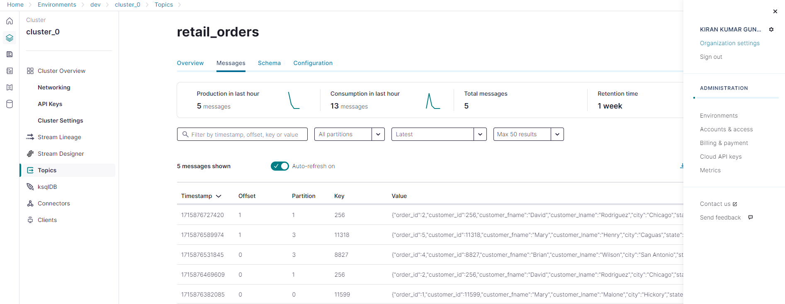

## Installation

### Terraform installation

##### On Amazon Linux

```sh
sudo yum install -y yum-utils
```
```sh
sudo yum-config-manager --add-repo https://rpm.releases.hashicorp.com/AmazonLinux/hashicorp.repo
```
```sh
sudo yum -y install terraform
```
#### Verify the installation

```sh
terraform --version
terraform -help
```

### AWS CLI installation

```sh
curl "https://awscli.amazonaws.com/awscli-exe-linux-x86_64.zip" -o "awscliv2.zip"
unzip awscliv2.zip
sudo ./aws/install
```
#### Verify the installation

```sh
aws --version
```

#### configure aws credentials: provide access key and secret access key

```sh
aws configure
```
    


### Deployement.
#### Lets verify if we already have the bucket that we want to provision

```sh
aws s3api list-buckets --query 'Buckets[*].[Name]' --output text | grep "spotify"
```

#### Initiate the terraform
```sh
terraform init
```
#### Plan your actions
```sh
terraform plan
```
#### Create your aws resources
```sh
terraform apply
```
#### Delete your aws resources
```sh
terraform destroy
```


